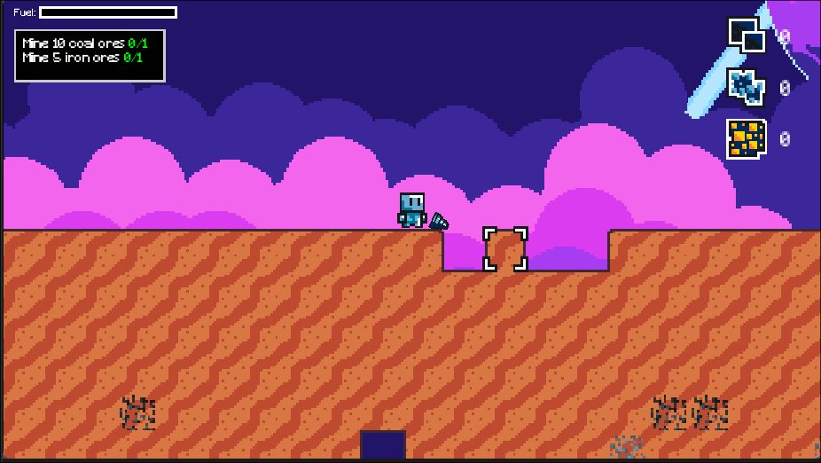

<!-- Ad Maiorem Dei Gloriam! -->
# A-Journey-Of-A-Robot
A 2D Game about mining on a planet while managing the planet stability

## About
The game is made on the Godot Engine tool and is about mining on a planet. The project is on early stage, so no many features are implemented by now.
This was made by 2 friends for Hackclub Thirdspace.

## Mechanics
The main game mechanic is mining. The player have a drill and has to mine some ores.
- The player have a jetpack with fuel that recharges
- The player can mine with the drill
- The game have one layer
- The map is generated on runtime
  - The map has a total of 5 sections
    - The premise of the map is that the farther the user goes away from the origin, the more varied the terrin will become. 
    - The ores are placed by getting a all of the map coordinates, and then placing ores until that ore count has been reached
    - The holes in the map come from a noise function, and any tile with a high noise value will be deleted 
- The game have a menu

## Future plans
The game isn't complete yet. The next features are planned:
- [] Make the main base
- [] Make a tech-tree system
- [] Make a crafting system
- [] Add a smelting system 
- [] Add more layers (1/7)

## AI Usage declaration
AI was used only in very specific causes. No single line of code was generated by it. Instead, some architectural decisions and good practice questions were made to learn more Godot. (eg. Should this be a chain of signals or an autoload? Which can be more decoupled?)
