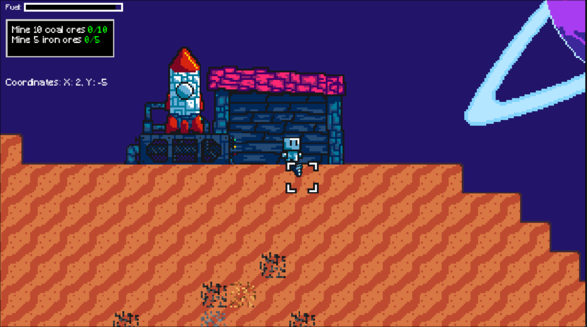
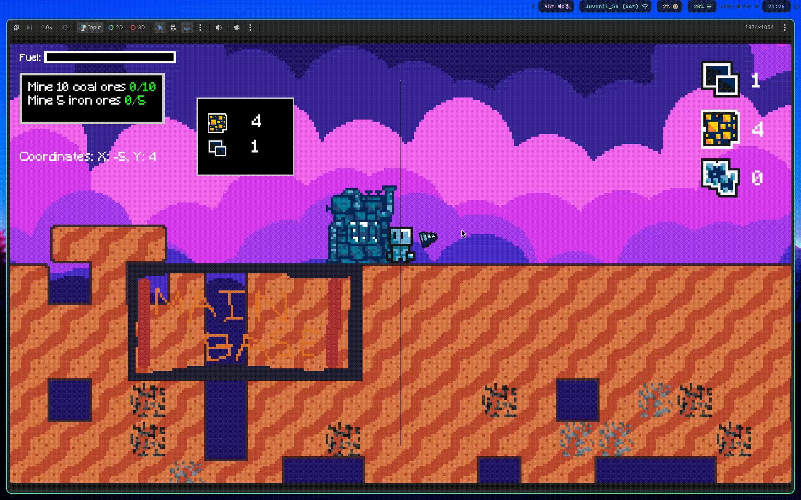
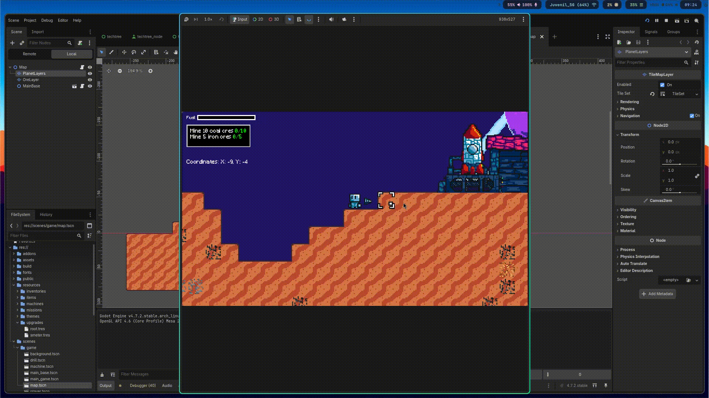

<!-- Ad Maiorem Dei Gloriam! -->
# A-Journey-Of-A-Robot
A 2D Game about mining on a planet while managing the planet stability



## About
The game is made on the Godot Engine tool and is about mining on a planet. The project is on early stage, so no many features are implemented by now.
This was made by 2 friends for Hackclub Thirdspace.

## How to run
Go to the itch.io page https://huntorbehunted83.itch.io/journey-of-a-robot and play it directly on your browser! Optionally, you can build it from source [right here](#build-from-source)

## Mechanics
The main game mechanic is mining. The player have a drill and has to mine some ores.
- The player have a jetpack with fuel that recharges
- The player can mine with the drill
- The game have one layer
- The map is generated on runtime (update: now it is fully procedural generated!)
  - The map has a total of 5 sections
	- The premise of the map is that the farther the user goes away from the origin, the more varied the terrin will become. 
	- The holes in the map come from a noise function, and any tile with a high noise value will be deleted 
- The game have a menu

## Build from source
You can download the github source code as a ZIP, unzip it and import on the Godot Game Engine. Alternativelly, you can use git:
```bash
git clone https://github.com/Renan-G-Projec/A-Journey-Of-A-Robot.git
```
and then open on Godot.

## Input mapping
- The input mapping is the following:
- D / Right -> Goes right
- A / Left -> Goes left
- E -> Interacts with special elements (such as machines and the main base)
- Space -> Activates the jetpack
- Click -> Mines the ores
- Right-click -> Places the ores

## Notes
- The UI for the block placing is not done yet. You can place the amount of blocks that you placed
- The Machine input panel is unaligned. It will be fixed next week.
- The building system (not the block placing, but building machines and placing on the map) is not complete yet.

## Incomplete systems
These systems are in development. They're NOT fully functional right now but should be connected easily in the future.

- Tech tree:

- Smelting ore Machinee:

- Crafting system:

- Block placing:


## Future plans
The game isn't complete yet. The next features are planned:
- [x] Make the main base
- [x] Make a tech-tree system
- [] Make a crafting system (in progress...)
- [x] Add a smelting system 
- [] Add more layers (3/7)


## AI Usage declaration
AI was used only in very specific causes. The only piece of code generated by it was the function update_terrain_area_sliced to improve performance to an acceptable level. Some good practice questions were made to learn more Godot. (eg. Should this be a chain of signals or an autoload? Which can be more decoupled?)
None art assets or sound effects were made with AI. 
